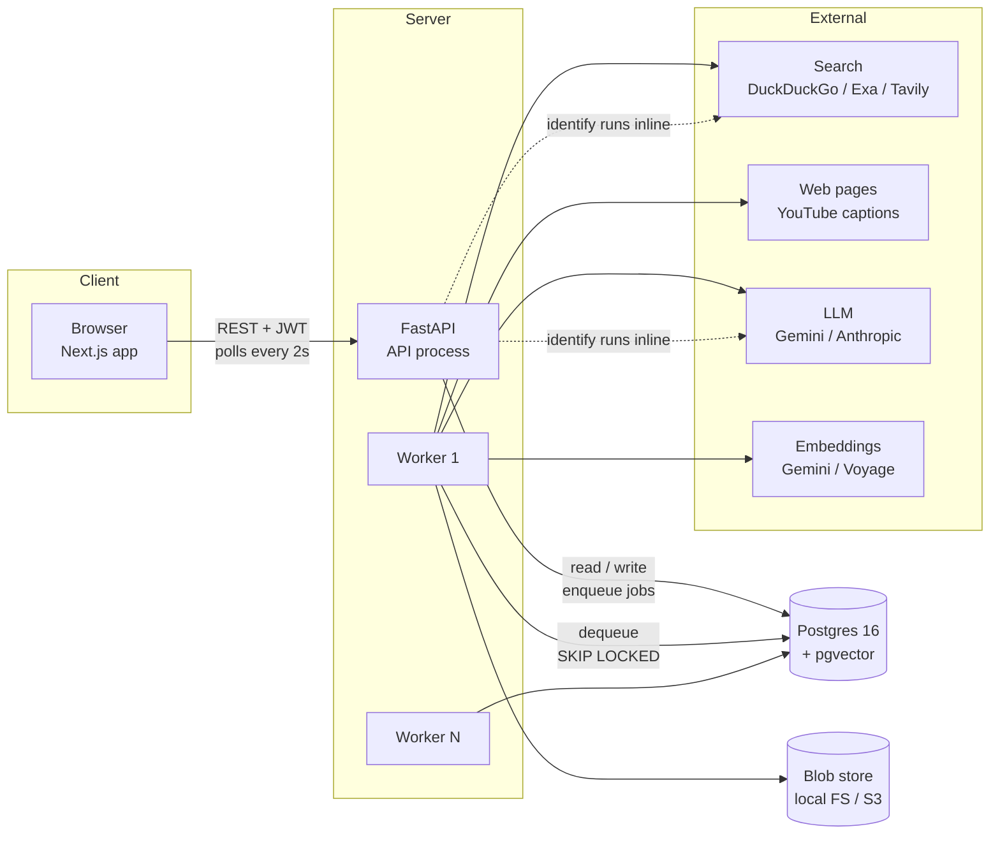
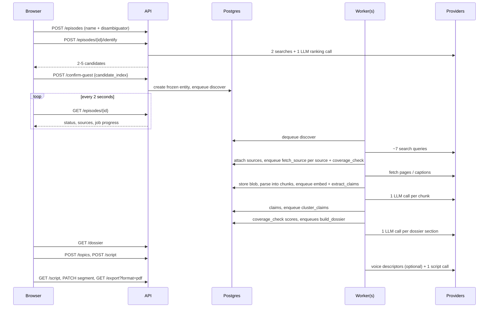
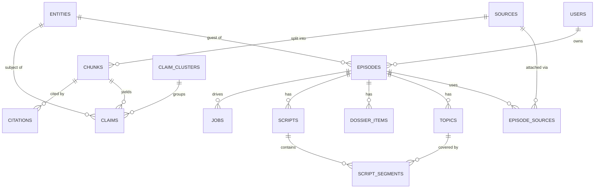
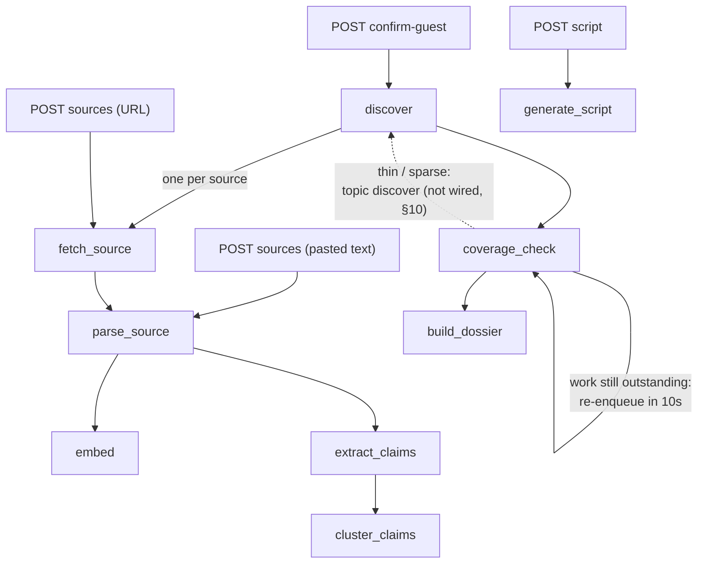
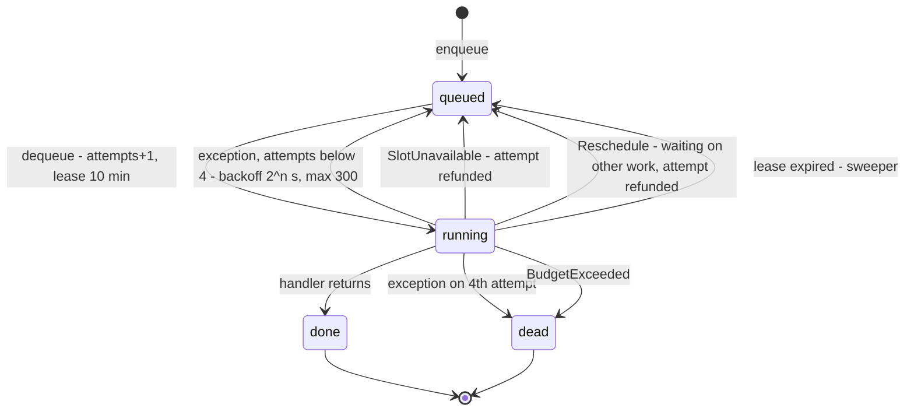
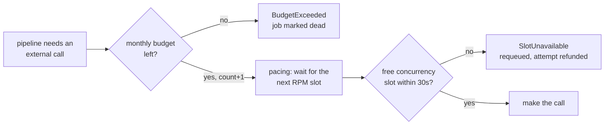
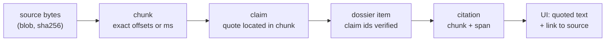

# Scripto — System Design

Last updated: 2026-09-10. Status: v1 proof of concept.

This describes the system as it actually is, including what is not working yet.
It covers what each part does, why it was built that way, what was rejected,
and what we learned by running it against real providers. Use it as the
starting point for going deeper into any part of the design.

---

## Contents

1. [What the system does](#1-what-the-system-does)
2. [Architecture at a glance](#2-architecture-at-a-glance)
3. [Technology choices and why](#3-technology-choices-and-why)
4. [Data model](#4-data-model)
5. [The pipeline, stage by stage](#5-the-pipeline-stage-by-stage)
6. [The job system](#6-the-job-system)
7. [External providers](#7-external-providers)
8. [Rate limits and cost control](#8-rate-limits-and-cost-control)
9. [The trust chain: how citations are guaranteed](#9-the-trust-chain-how-citations-are-guaranteed)
10. [Coverage modes and the topic brief](#10-coverage-modes-and-the-topic-brief)
11. [API](#11-api)
12. [Frontend](#12-frontend)
13. [Configuration reference](#13-configuration-reference)
14. [Testing, provider checks and evals](#14-testing-provider-checks-and-evals)
15. [Local development environment](#15-local-development-environment)
16. [What real-provider testing taught us](#16-what-real-provider-testing-taught-us)
17. [Known gaps and open problems](#17-known-gaps-and-open-problems)
18. [Deferred work and the seams left for it](#18-deferred-work-and-the-seams-left-for-it)
19. [Code map](#19-code-map)

---

## 1. What the system does

A podcast host enters a guest's name plus one disambiguator (LinkedIn URL, firm,
or X handle). Scripto:

1. finds 2–5 candidate identities and makes the host pick the right one,
2. discovers and reads public sources about that person (articles, interviews,
   YouTube captions, pasted notes),
3. extracts atomic claims from those sources, each pinned to an exact span of
   source text,
4. writes a **dossier** — career timeline, recent news, public positions, things
   they have said repeatedly ("already covered"), unexplored angles,
5. suggests topics from the episode title and the research, then writes a timed
   **run-of-show** for the host's topics, length and style: an opening, one block
   per topic with a spoken transition into each, backup topics, and a closing,
6. lets the host edit it and export a PDF.

The product promise is that **every line links back to a source the host can
open**. Most of the design exists to make that promise hold.

Scope, from `build-spec-v1.md`: one episode, one guest, one script.
Explicit non-goals for v1: no LinkedIn/Instagram scraping, no audio
transcription (YouTube captions only), no team collaboration, no publishing, no
topic ideation (the user supplies topics), no billing.

**Scope change (2026-09-14).** Topic ideation was a v1 non-goal. The host asked
for it, so Scripto now suggests topics, each labelled as backed by research or
taken from the episode title alone (§5.10). The script also grew from one
question per topic into a timed run-of-show. Topic research and the topic brief
now cover every episode with topics, not only thin and sparse guests (§10).

---

## 2. Architecture at a glance



Properties that the rest of the design depends on:

- **The API process does not run pipeline work.** It validates, writes rows and
  enqueues jobs. The one exception is identity lookup, which runs inline because
  the user cannot do anything until it returns.
- **Workers are stateless.** Scaling out means adding worker processes. All
  coordination happens in Postgres.
- **Postgres is the only stateful service.** It holds relational data, vectors,
  the job queue, advisory locks, rate-limit state and spend budgets.
- **Every external call goes through one chokepoint**, `provider_slot()` in
  `api/scripto/jobs/limits.py`, which enforces budget, pacing and concurrency.
- **Raw payloads are stored before parsing**, so everything downstream can be
  recomputed without the network.

### One episode, end to end



---

## 3. Technology choices and why

Each entry: what we chose, why, what we rejected, and when to revisit.

### 3.1 Python 3.12, FastAPI, SQLAlchemy 2, Alembic

- **Why.** Fixed by the spec, and a good fit anyway. Python has the strongest
  libraries for the hard parts of this product: text extraction (`trafilatura`),
  PDFs (`pypdf`), YouTube captions (`youtube-transcript-api`), tokenisers
  (`tiktoken`) and first-party LLM SDKs. FastAPI gives typed request and response
  models through Pydantic and generates OpenAPI docs at `/docs`. SQLAlchemy 2's
  typed mappings keep models readable. Alembic manages migrations; there are 8 so
  far.
- **Python version.** The machine has 3.14, but several libraries lag behind, so
  `uv` pins a 3.12 virtualenv.
- **Revisit.** No reason to.

### 3.2 Postgres 16 + pgvector as the only datastore

- **Why.** The workload is bursty, long-running and IO-bound. It is not high
  QPS. One database can carry relational data, vectors, the queue, locks,
  rate-limit state and budgets. The spec rules out a separate vector database,
  Redis and Kafka.
- **Postgres features we rely on:**
  - `SELECT … FOR UPDATE SKIP LOCKED` for the job queue (§6)
  - session advisory locks for provider concurrency slots (§8.3)
  - transaction advisory locks to serialise clustering per guest (§5.7)
  - `INSERT … ON CONFLICT` for idempotency keys, budgets and pacing
  - `clock_timestamp()` rather than `now()` for queue timing (§6.4)
  - JSONB for flexible fields (candidates, coverage detail, follow-ups)
- **Rejected.** Redis + Celery (another stateful service to run, and the spec
  rules it out). A dedicated vector database (unnecessary below many thousands
  of users).
- **Honest note.** The `Vector(1024)` columns on `chunks` and `claims` store
  embeddings, but nothing queries them through pgvector yet. There is no ANN
  index, and clustering computes cosine similarity in Python. For now pgvector is
  only storage.
- **Revisit** when a single guest has thousands of claims. At that point, add an
  HNSW index and move similarity search into SQL.

### 3.3 A Postgres job queue instead of Celery

Covered in §6. The short version: enqueueing in the same transaction as the data
change means no lost or phantom jobs, no extra infrastructure, and the whole
queue is inspectable with SQL.

### 3.4 Client polling instead of websockets

- **Why.** The spec calls for it. The API stays stateless, polling works through
  any proxy, and pipeline progress only changes every few seconds anyway.
- **Cost.** One request every 2 seconds per open episode tab, which is trivial at
  this scale.

### 3.5 Next.js App Router, TanStack Query, Tailwind

- **TanStack Query** handles polling (its `refetchInterval` is a function of the
  current data, so polling stops when work finishes), caching, and invalidation
  after mutations.
- **Tailwind** for speed. There is no component library.
- Every page is a client component. The auth token lives in `localStorage`. That
  is simple but exposed to XSS; move to httpOnly cookies before real users.

### 3.6 Blob storage behind an interface

- Raw payloads (HTML, PDF bytes, caption JSON, pasted text) are written to blob
  storage **before** parsing, keyed by their sha256 checksum.
- **Why.** Extraction will be re-run many times as prompts and models improve.
  Refetching is slow and sometimes impossible (pages change or disappear). The
  spec's acceptance criterion "reparsing requires no network fetches" depends on
  this, and so does cross-user dedupe.
- `LocalBlob` writes atomically (write a temp file, then rename). An `S3Blob`
  implementation exists but has not been tested.

### 3.7 The LLM provider abstraction

- **Pipeline stages ask for a role, never a model.** The roles are `extract`,
  `compose` and `rank`, and the provider maps each one to a model through
  environment variables.
- **Why roles.** The spec wants a cheap model for extraction and a strong one for
  composition, and the volumes are very different: extraction makes one call per
  chunk (dozens to hundreds per episode), while composition makes about six.
- **Implementations:**
  - `AnthropicProvider`: the official `anthropic` SDK, with structured output via
    `output_config.format`. Written, but **never run against a live key**.
  - `OpenAICompatibleProvider`: the `openai` SDK pointed at any compatible
    endpoint. Used for Gemini through Google's OpenAI-compatible URL. Also works
    for Groq, xAI and DeepSeek.
  - `FakeProvider`: deterministic and schema-aware. It dispatches on the
    schema's `title`, so tests and evals run with no keys.
- **Every call returns JSON matching a schema.** On the OpenAI-compatible path,
  the provider first tries strict `json_schema`, falls back to `json_object`, and
  then runs `coerce_to_schema()`. That last step exists because Gemini under
  `json_object` returned a bare array instead of `{"claims": [...]}`; when a
  schema has exactly one array property, the bare array is wrapped into it.
- **Reasoning effort is set per role** (`LLM_EXTRACT_REASONING_EFFORT`,
  `LLM_COMPOSE_REASONING_EFFORT`). Extraction is mechanical: with thinking on,
  `gemini-3.5-flash` took 46.6 s per call; with `reasoning_effort: none` it took
  about 2 s. If an endpoint rejects the parameter with a 400, the call is retried
  without it.
- `max_tokens` defaults to 16000. Reasoning models spend tokens before they
  write output, and a truncated response cannot be parsed.

### 3.8 Why Gemini, for now

- The user has a Gemini key, the free tier costs nothing, and the
  OpenAI-compatible endpoint meant no new code.
- **What testing against it showed (2026-09-10):**
  - Pro models are not on the free tier: `gemini-pro-latest` and
    `gemini-3.1-pro-preview` return 429.
  - `gemini-3.5-flash` used up its daily quota during testing. Quotas are per
    model.
  - `gemini-3.8-flash` returned 503 "high demand" on every attempt.
  - `gemini-2.5-flash` appears in the model list but returns 404. Listed does not
    mean available, so `check_provider --models` should be run before trusting a
    model id.
  - The current choice is `gemini-3.1-flash-lite` for all three roles, at about
    2 s per call.
- Versions are pinned rather than using the `-latest` aliases, so that eval runs
  stay comparable across changes.
- **Revisit.** Extraction accuracy decides this (§9). If it stays around 80%, use
  a stronger or paid model for `LLM_EXTRACT_MODEL` only.

### 3.9 Why DuckDuckGo search, for now

- It needs no key, no card and no signup (Tavily's free plan asked for a card).
  It is implemented with the `ddgs` library.
- **Tradeoff.** It is unofficial: it reads DuckDuckGo's public endpoints, is rate
  limited, and can break whenever they change their markup. In the real test, 2
  searches found 25 sources.
- Exa and Tavily providers are written. Switching is one environment variable.

### 3.10 Embeddings

- Currently set to **`fake`**: a hashed bag-of-words. It is deterministic but
  cannot match paraphrases, so clustering is not meaningful yet.
- Gemini (`batchEmbedContents`) and Voyage are implemented. The Gemini provider
  requests `outputDimensionality=1024` and renormalises, so its vectors fit the
  schema's `Vector(1024)` columns with no migration.

### 3.11 Auth

- Email and password, one workspace per user. The spec asked for something
  boring.
- Passwords are hashed as **bcrypt over base64(sha256(password))**. bcrypt
  silently truncates input at 72 bytes, so pre-hashing to a fixed 44 bytes means
  long passwords keep their full strength. `passlib` was dropped because it is
  unmaintained and breaks with bcrypt ≥ 4.
- Tokens are JWT (HS256) with a 14-day expiry and the secret from `JWT_SECRET`.
- **Revisit** before real users: refresh tokens, httpOnly cookies, and rate
  limiting on login.

### 3.12 Tooling

`uv` for Python environments (fast, and it manages the interpreter version). npm
for the web app (pnpm is not installed). pytest for tests. Ruff configuration is
present.

---

## 4. Data model



### The two decisions that carry the economics

1. **Sources are global, not per episode.** They are unique on `canonical_url`
   and on `checksum`, so two users researching the same guest never refetch or
   reparse the same page. `episode_sources` is the join table. Removing a source
   from an episode sets `removed_at` and never deletes the source.
2. **Claims belong to the entity, not the episode.** A second episode with the
   same guest reuses every claim already extracted, which is most of the cost.
   Claims are unique on `(chunk_id, text_hash, extractor_version)`, so running
   extraction with a new model version creates a new claim set instead of
   overwriting the old one. `extractor_version` is
   `provider:extract_model/compose_model`, which can be 60+ characters; that is
   why the column is 255 wide (§16).

### Tables

| Table | Purpose | Notable details |
|---|---|---|
| `users` | Accounts | bcrypt-over-sha256 hash |
| `entities` | A person, company or topic | Display fields (headline, employer, photo) are frozen at identification |
| `episodes` | One research job | `status`: identifying → ingesting → dossier_ready → script_ready. `coverage_detail` JSONB also holds the identity candidates |
| `sources` | One fetched document, shared globally | `status`: pending, fetched, parsed, failed. `error` is shown in the UI |
| `episode_sources` | Links episodes to sources | `added_by` is system or user; `removed_at` is a soft remove; `subject_entity_id` says whether the source serves the guest or the topic brief (NULL means the guest); `topic` is the host topic a topic-research source was found for |
| `chunks` | A piece of a source, about 750 tokens | Exactly one position pair is set: character offsets for text, milliseconds for audio/video. A CHECK constraint enforces it |
| `claims` | One atomic assertion about an entity | `kind`: biographical, opinion, fact, anecdote, prediction. `span_start`/`span_end` locate its quote inside the chunk |
| `claim_clusters` | Groups of claims that say the same thing | `source_count` counts **distinct sources**, not claims |
| `topics` | The host's 3–6 topics | |
| `dossier_items` | One dossier line | Carries `claim_ids`. `cluster_id` is ON DELETE SET NULL |
| `scripts` / `script_segments` | Script versions and their timed blocks | `scripts.duration_minutes`. Each segment is an opening, topic, closing or backup block with start minute, planned minutes, transition, host lines, lead and deeper questions, follow-ups, risk flags, `flagged_unsourced` and `edited_by_user` |
| `citations` | Links a dossier item or segment to a chunk span | `target_type` is dossier_item or script_segment |
| `jobs` | The work queue | §6 |
| `usage_counters` | Per-user daily quotas | |
| `provider_budgets` | Monthly call ceilings per provider | §8.1 |
| `provider_pacing` | Next allowed call time per provider | §8.2 |

### Where the model departs from the spec

Added: `dossier_items` (the dossier needed to be stored somewhere, and citations
point at it), `usage_counters`, `provider_budgets`, `provider_pacing`, and the
`coverage_check` job kind. Claims gained `span_start`, `span_end`, `text_hash`
and `embedding`. Jobs gained `idempotency_key`. Episodes gained
`topic_entity_id`, `guest_name`, `disambiguator` and the coverage fields.

### Migrations

`api/scripto/migrations/versions/`, in order: initial schema (which also creates
the `vector` extension), provider budgets, provider pacing, widen
`extractor_version`, dossier cluster FK set null, run-of-show script segments
(which also widens `scripts.model_version` for the same reason as §16), script
revisions (`parent_script_id`, `feedback`), and source subjects
(`episode_sources.subject_entity_id`, backfilled from job payloads and claims).

---

## 5. The pipeline, stage by stage



| Stage | Triggered by | External calls | Idempotency key | If it fails |
|---|---|---|---|---|
| identify | `POST /identify`, inline | 2 searches, 1 LLM | none | 422 to the user |
| suggest topics | `POST /topics/suggest`, inline | 1 LLM | none | 429 / 503 / 502 to the user |
| discover | confirm-guest (guest) or the coverage check (topic) | ~7 searches (guest), up to 8 (topic) | `discover:{episode}`, `discover-topic:{episode}` | per-query errors are skipped; running out of search budget stops early |
| fetch_source | discover or user URL | 1 fetch | `fetch:{source}` | source marked failed; the job itself succeeds |
| parse_source | fetch or pasted text | none | `parse:{source}:{checksum}` | source marked failed |
| embed | parse | batches of 64 | `embed:{source}:{checksum}` | retry, then dead |
| extract_claims | parse | 1 LLM per chunk | `extract:{source}:{subject}:{checksum}` | retry, then dead |
| cluster_claims | extract, at most one waiting per subject | embeddings + LLM confirmations | none | retry, then dead |
| coverage_check | each discovery run, a source added, topics set | none | `coverage:{episode}:{discover job}` for discovery runs | waits by rescheduling itself, adding no rows |
| build_dossier | coverage_check | 1 LLM per section | `dossier:{episode}:{mode}:{guest claims}:{topic claims}` | retries if 0 items were built from >0 claims |
| generate_script | `POST /script` | 0–1 voice + 1 script | `script:{script}` | retry, then dead |

### 5.1 Identify — `pipeline/identify.py`

- Runs two searches, `"{name}" {disambiguator}` and `"{name}" profile bio`, with
  8 results each, and dedupes the URLs.
- One LLM call (role `rank`) returns up to 5 candidates with name, headline,
  employer, evidence URLs, confidence and reasoning, sorted by confidence. They
  are stored in `episode.coverage_detail.candidates`.
- **The system never picks a candidate.** A wrong identity poisons everything
  downstream, so the spec makes this step unskippable. `POST /confirm-guest`
  creates the entity row, freezes it, sets the episode to `ingesting`, and
  enqueues discover.
- A name with no disambiguator is rejected at validation (422).
- A registered `identify` job handler exists, but the route runs identification
  inline because the user is waiting on it.

### 5.2 Discover — `pipeline/discover.py`

A discovery run researches one subject: the guest, or (for any episode with
topics) the topic entity named in the job payload.

- **Guest queries**, 6 results each: `"{name}" {employer} news` ·
  `"{name}" interview` · `"{name}" podcast` · `"{name}" site:youtube.com` ·
  `"{name}" blog OR substack OR essay` · `"{name}" bio {employer}` · and, when an
  employer is known, `"{name}" {employer} earnings call OR 10-K OR filing`.
- **Topic queries:** `{topic} explained` and `{topic} latest research` for each
  new topic. The source allowance is split evenly across topics (3, 3 and 2 for a
  limit of 8 and three topics). A shared allowance let the first topic's results
  fill every slot: a real run found 8 articles on focus and none on supplements
  or sleep.
- **Each topic source records the topic it was found for** (`episode_sources.topic`).
  Extraction reads the source against that one topic. Topic sources used to be
  read against a label naming only the host's first three topics, so pages about
  later topics yielded almost nothing: a Nature paper on habit extinction gave 20
  sections and 0 claims.
- **Pages that can never be read are skipped** (`is_readable()`): a YouTube URL
  with no video id is a channel, playlist or search page and carries no
  transcript. `"{name}" site:youtube.com` returns those by the handful, and one
  real run spent 6 of its 8 slots on them, leaving the episode a single usable
  source.
- Every search is charged to the search budget and paced on its own. Until
  2026-09-15 the whole run counted as one charge, so the budget undercounted by
  about 7×.
- It canonicalises and dedupes URLs and stops at `MAX_SOURCES_PER_EPISODE` for
  this run. Guest research and topic research each get that allowance. Sources
  the host adds by hand have their own allowance and are never blocked by
  discovered ones.
- `attach_source()` reuses the global source row if one exists. A new source
  gets a fetch job. A source already parsed for another episode goes straight to
  extraction for this subject. Both carry the subject id, so claims are
  attributed to the guest or to the topic as appropriate.
- Then it enqueues one `coverage_check` for this run.
- **How many sources is enough?** Nothing decides that yet. Discovery takes the
  first results until the allowance is used up, with no ranking by quality, and
  never searches further when coverage turns out thin (§17).
- **URL canonicalisation** (`adapters/base.py`) forces https, lowercases the
  host, strips `www.` and default ports, drops tracking parameters (`utm_*`,
  `fbclid`, `gclid`, `mc_*`, `ref_*`, `igshid`), strips the trailing slash and
  drops the fragment. This function decides whether two users share a fetch.

### 5.3 Fetch — `pipeline/fetch.py` and `adapters/`

- If the blob already exists, fetch is skipped and the stage goes straight to
  parsing, so retries are free.
- The adapter's `fetch()` runs under `provider_slot("fetch")`. The payload's
  sha256 becomes its checksum. If another source already has identical bytes and
  is parsed, this source is marked failed as a duplicate. Otherwise the blob is
  stored under its checksum, the status becomes `fetched`, and parse is
  enqueued.
- A `FetchError` marks the source failed with a readable error and **does not
  fail the job**. A bad source degrades the dossier but never fails the run
  (acceptance criterion).
- **Adapters.** Each implements `fetch(url) -> bytes` and
  `parse(bytes) -> ParsedSource`, and `parse` must not touch the network.
  - `web_article`: `httpx`, then `trafilatura` with precision favoured and
    metadata included.
  - `youtube`: walks an ordered list of `TranscriptStrategy` objects. Captions is
    on; Whisper is present but disabled (§18). The raw payload stored is the
    transcript JSON, with millisecond segments.
  - `pdf`: `pypdf`. Also the type an uploaded PDF takes.
  - `docx`: `python-docx`, for an uploaded Word resume or bio. Reads table cells
    as well as paragraphs, because resumes keep dates and employers in tables.
  - `user_pasted`: the blob is created at `POST` time and never fetched. This is
    also how thin-footprint guests get a bio, CV or notes into the system, and
    the type used for uploaded `.txt` and `.md` files.
  - `profile`: the same as `web_article`.
- `classify_url()` maps YouTube hosts to `youtube`, `.pdf` URLs to `pdf`,
  LinkedIn/X/Twitter to `profile`, and everything else to `web_article`.

**Uploads** (`POST /episodes/{id}/sources/upload`, multipart). The host supplies
material directly: `.pdf`, `.docx`, `.txt` or `.md`, up to `MAX_UPLOAD_BYTES`
(10 MB). The bytes go straight to the blob store, the source starts at `fetched`,
and parsing proceeds as for anything else, so uploaded material is cited exactly
like a discovered page. Files we cannot read are refused at the door (415) rather
than stored as a source that can never parse. Uploads count against the host's own
source allowance, never the discovery one.

**LinkedIn profiles cannot be fetched and never will be.** `linkedin.com/in/…`
answers `999` to anonymous requests; it is a deliberate block, and scraping
profiles is against LinkedIn's terms. Adding a profile URL is therefore refused
with guidance to upload the profile's own "Save to PDF" export, which is the
supported path. LinkedIn *articles* (`/pulse/`) and *posts* are ordinary pages and
still work as URLs. No LinkedIn API reaches a third party's profile either: sign-in
returns only the signed-in member's own name, photo and email, so it is an identity
mechanism, not a research one.

### 5.3a The guest prep link — `pipeline/prep.py`, `routes/prep.py`

Search cannot reach the one source that knows most: the guest. This is the
remedy, and the answer to a guest with little material online.

1. **Draft** (`POST /episodes/{id}/prep-questions/suggest?style=…`, inline, one
   compose call). These are **intake questions, not interview questions**: they
   ask what the guest wants from the conversation — what to spend time on, what
   they are tired of, what to avoid — so the host learns the guest's appetite
   while keeping their own angles unseen. A prep form that previews the interview
   costs the host every surprise the research bought them, so the prompt forbids
   naming what the research found: a question may reference a subject area at
   most, never the finding. Drafts are grounded in the dossier and cite the claim
   ids behind them for the host's eyes, shaped by the kind of show —
   `conversational`, `formal`, `contrarian`, `educational`, the same vocabulary
   the script uses. Questions that merely suit the format are labelled `format`.
   Nothing is stored.
2. **Approve** (`PUT /episodes/{id}/prep-questions`). The host edits, adds,
   removes, and saves. Only then are the questions the host's own.
3. **Publish** (`POST /episodes/{id}/prep-link`). Refused with `409` until a
   questionnaire is saved, so nothing reaches a guest that the host has not read.
   The token is `secrets.token_urlsafe(32)`: a capability URL, unique per
   episode, revocable by clearing it. Revoking keeps whatever already arrived.
4. **The guest answers** with no account. `GET /prep/{token}` returns the episode
   title, the guest's name and the question text — never the host's reasoning,
   the claim ids, the dossier or the script. They answer questions
   (`/answers`), attach a CV or bio (`/upload`), and add links or anything else
   (`/notes`).

**Feeding the script.** A run-of-show can be rebuilt from what the guest sent:
`POST /episodes/{id}/script` with `use_guest_prep: true` hands their own words to
the writer as *preference* — what to spend time on, what order, what to leave
alone — which is not something a claim can express. It is opt-in, the UI offers it
only once the guest has actually submitted something, and asking for it when
nothing was sent changes nothing: a run-of-show must never imply the guest weighed
in when they did not. `scripts.guest_prep_used` records it, and the prompt states
plainly that preference is not evidence — nothing from it may be asserted as fact
without a cited claim.

Everything the guest sends becomes an ordinary source, `added_by = "guest"`, with
its own allowance separate from the host's, so guest material can never be
crowded out by discovery. It is parsed, chunked and extracted like any page,
which means a line the host later writes from the guest's own words carries a
citation back to them. Answers are stored as question-and-answer pairs so the
context survives.

### 5.4 Parse and chunk — `pipeline/fetch.py`, `pipeline/chunking.py`

- Parses **only from the blob**. A test makes any `httpx.get` call raise during
  reparse, which proves no network is used.
- Deletes the source's existing chunks and re-chunks, so reparsing after an
  extractor improvement leaves nothing stale.
- **Text** is split on sentence boundaries and packed to about 750 tokens (the
  `tiktoken` `cl100k_base` count) with about 100 tokens of overlap, carried over
  as whole trailing sentences. A single sentence longer than the target becomes
  its own chunk rather than being cut mid-sentence. Offsets resolve exactly
  back to the source text, and a test checks this.
- **Audio/video**: caption cues are far too small to use individually, so they
  are packed up to the token target. The chunk's millisecond range covers the
  whole group, and the speaker is set when every cue in the group has the same
  one.
- `cl100k_base` is OpenAI's tokenizer, so it only approximates Gemini and Claude
  token counts. That is fine for sizing chunks.
- Parse then enqueues `embed` and `extract_claims`.

### 5.5 Embed — `pipeline/embed.py`

- Embeds any chunks that lack an embedding, in batches of 64, under
  `provider_slot("embedding")`.
- **Nothing reads chunk embeddings yet.** Dossier retrieval selects claims by
  kind, date and cluster, not by vector search. These embeddings are groundwork
  for semantic retrieval later.

### 5.6 Extract claims — `pipeline/extract.py`

- One LLM call (role `extract`) per chunk, with the schema
  `{claims: [{text, kind, claim_date, quote}]}`.
- **The guard is enforced in code, not in the prompt.** `locate_quote()` looks
  for the model's `quote` in the chunk: an exact match first, then a
  whitespace-tolerant regex, with a minimum of 8 characters. If the quote cannot
  be found, the claim is dropped. The claim's span is **the location of the
  match**, so it is right by construction.
- **Why quotes instead of offsets.** The first version asked the model for
  `[start, end]` character offsets. On real output, 30% of those offsets pointed
  at text unrelated to the claim: they were in bounds, so they passed the bounds
  check, but they were wrong. Models copy text accurately and count characters
  badly (§9).
- A fallback path still accepts `verbatim_span` offsets for providers that
  return them. It only checks bounds, so it is weaker.
- Chunks already extracted at the current `extractor_version` are skipped.
  Inserts use `ON CONFLICT DO NOTHING` on `(chunk_id, text_hash,
  extractor_version)`.
- If anything was produced, `cluster_claims` is enqueued with a 10 s delay,
  unless one is already waiting for this subject. That run will see every claim
  that exists when it starts, so a 10-source episode clusters once, not 10 times.
- **Identity gate.** Before a *discovered* page is mined for a person, one cheap
  call (role `rank`) asks whether the page is about the person the host
  confirmed, given their role, employer and known links, plus the page's opening.
  The verdict is stored on `episode_sources.identity` (`ok` / `mismatch`); a
  mismatch takes no claims at all and the UI labels that source **not this
  person**. Sources the host or the guest supplied are trusted and skip the gate —
  they know who they meant. The extractor is also told *which* person the subject
  is, so a same-name passage inside a page that passed the gate still yields
  nothing.
- **Why it exists.** Identity was verified once, at confirmation, and then
  trusted forever. For a common name that is fatal: a Times Now author page for a
  *different* Pranjal Gupta — a journalist — contributed five "facts" to a
  JPMorgan engineer's dossier, among them that he "appreciates theatre", taken
  from "she values all kinds of art forms, from theatre and cinema to anime". The
  prep drafter then asked him about the theatre background he does not have. Both
  failures were real: the wrong person's page, and a question asserting more than
  its claim said (§5.3a).
- **Gap.** Within a page that passes the gate, "only claims about the subject" is
  still enforced by the prompt alone. A claim about Steve Ballmer inside a Nadella
  article could get through. Eval traps are meant to catch this.

### 5.7 Cluster claims — `pipeline/cluster.py`

- Takes a **transaction-scoped advisory lock per subject** first. Clustering
  rewrites every cluster row for that subject, and two concurrent runs
  deadlocked against each other (§16). A waiting run simply goes next and sees
  the newer claims.
- Embeds any claims that lack a vector, then deletes and rebuilds all clusters
  for the subject, since clusters are derived data.
- Uses **greedy single-pass centroid clustering** at cosine ≥ 0.86. It is O(n·k)
  in Python, which is fine for hundreds of claims and avoids a clustering
  dependency.
- Only groups that span **≥ 3 distinct sources** get an LLM confirmation call
  (`same_claim`, `canonical_text`), because only those can reach "already
  covered". Rejected groups are split into singletons. Every claim ends up in a
  cluster.
- **Gap.** This has never run with real embeddings, so "already covered", which
  the spec calls the most valuable output, is unproven.

### 5.8 Coverage check — `pipeline/coverage.py`

- Waits until the episode has no queued or running `discover`, `fetch_source`,
  `parse_source`, `extract_claims`, `embed` or `cluster_claims` jobs. While it
  waits it raises `Reschedule`, which puts the same job back in the queue 10 s
  later. It used to insert a new job every 10 s instead. That is what made the
  progress bar's total climb: 33 of one real episode's 82 jobs were these checks.
- Scores **the guest's own sources only** (topic research articles once counted
  too): parsed, failed and total; claim count; cluster count; the date span of
  the claims; and whether a long-form appearance exists. Long-form means a
  YouTube source, or a page of ≥ 8000 characters whose title or URL marks it as
  an interview, podcast, talk or transcript. A long Wikipedia page used to count.
- Chooses a mode. **Rich** needs 75% of the source limit readable (6 when the
  limit is 8, 19 when it is 25, never fewer than the thin threshold plus one),
  ≥ 15 clusters and a long-form appearance. **Thin** needs ≥ 3 readable sources;
  anything less is **sparse**. It also records a `missing[]` list of specific
  things to ask the host for.
- "Rich" used to need a fixed 8 readable sources while discovery fetched 8, so a
  single failed download ruled it out. That is why Satya Nadella and Andrew
  Huberman were both first labelled "thin".
- For every episode with topics, it starts research on any topic not
  researched before (§10).
- Enqueues `build_dossier`, keyed on the mode and the claim counts for both the
  guest and the topic, so new claims always trigger a rebuild.
- Each discovery run gets its own check (key `coverage:{episode}:{discover job}`).
  A single shared key used to discard the topic run's check, and one real
  dossier missed 24 claims that arrived 16 seconds after it was built (§16).

### 5.9 Build dossier — `pipeline/dossier.py`

- Deletes the previous items and citations, then composes five guest sections.
  Each section retrieves up to 60 claims, makes one compose call, and runs a
  verification pass.

| Section | Claims retrieved |
|---|---|
| career_timeline | `biographical`, oldest first |
| recent_news | `claim_date` within the last 365 days, newest first |
| public_positions | `opinion` and `prediction`, oldest first, so shifts over time show |
| already_covered | claims in clusters with `source_count ≥ 3` |
| unexplored_angles | `fact`, `opinion` and `anecdote`, least-covered clusters first |
| topic_brief | the topic entity's `fact`, `opinion` and `prediction` claims, an even share per host topic (every episode whose topics were researched; §10) |

- **Topic brief balance.** Newest-first retrieval let the first topic researched
  fill the brief, because almost no topic claims carry a date. A real run offered
  the writer 44 claims on focus, 13 on sleep, 2 on supplements and none on
  circadian rhythms or habit extinction. Claims are now taken one topic at a
  time, and within a topic one source at a time, up to the 60 limit. The prompt
  groups them under their topic and asks for every topic to be covered.
- **Topic gaps.** A researched topic that yielded no usable claims is listed in
  `coverage_detail.topic_gaps`, and the dossier panel says so instead of quietly
  leaving it out. The list stays empty while research is still running.

- **Verification.** An item survives only if at least one of its `claim_ids` is
  in the set of claims actually given to the model. A made-up id counts the same
  as no id, and the item is dropped. Citations are then created from each
  claim's chunk and span.
- If it builds **0 items while the subject has claims, it raises**, so the job
  retries instead of reporting an empty page as success (§16).
- `recent_news` depends on `claim_date`, which extraction often leaves empty.
  The real run produced one item there.

### 5.10 Topic suggestions and the run-of-show — `pipeline/suggest.py`, `pipeline/script.py`

**Topic suggestions** (`POST /topics/suggest`, inline like identify, one compose call):

- The model gets the episode title (the theme), the guest, the host's existing
  topics, the dossier lines with their claim ids, and what the guest has already
  covered repeatedly.
- Each suggestion is labelled in code, not by the model: **research** if at least
  one of its claim ids is a real claim about the guest, otherwise **title** ("from
  the title only — not researched"). Research suggestions come back with a quoted
  citation.
- Repeats of the host's topics and duplicate suggestions are dropped in code.
  Suggestions are not stored; the host adds the ones they want to their topics.
- This reverses a v1 non-goal (§1).

**The run-of-show.** A script is an ordered list of blocks, each a
`script_segments` row with a `segment_type`:

| Block | Holds |
|---|---|
| opening | a hook, a guest introduction built from cited research, a warm-up first question |
| topic (one per host topic) | a spoken transition in, a lead question, deeper questions, follow-ups, rationale, expected direction, risk flags |
| closing | a transition, a final question, a one-line wrap-up |
| bonus (backup) | 2–3 topics outside the plan, for when a block runs short or falls flat; not on the clock |

**The code owns the clock** (`plan_run_of_show`). Models are bad at arithmetic
(the same lesson as character offsets, §5.6), so the timing is computed first and
given to the model as fixed:

- opening and closing each get about 7% of the length, between 2 and 8 minutes;
- the rest is split equally across topics, with spare minutes going to the
  earliest ones, so the blocks always add up to exactly the booked length;
- each topic's question count is its minutes divided by the style's pace (about 4
  minutes per question for conversational and contrarian, 5 for formal and
  educational), capped at 8.

Example: 60 minutes, conversational, 3 topics gives an opening 0:00–0:04, topic
blocks of 18, 17 and 17 minutes with 4 questions each, and a closing 0:56–1:00.

**Flow.** Each topic block starts with a transition the host can say aloud, built
on where the guest will likely have gone in the previous block (its expected
direction). By default the model may reorder topics for a better arc; with
`optimize_order: false` the code enforces the host's order. Start times are set in
code after the order is fixed.

**Guards in code:**

- a topic the model skipped still gets its slot, with a placeholder question and an
  "auto-filled" risk flag;
- deeper questions are cut to the planned count;
- claim ids are filtered to real claims about the guest, and citations are built
  from them;
- any block except the closing that cites nothing is kept but marked
  `flagged_unsourced`, and the UI and PDF show that. Dropping it would leave a hole
  in the timeline;
- bare UUIDs are removed from every text list, since Gemini put a claim id into
  `risk_flags` on the first real run;
- each generation is a new script version; earlier ones stay stored.

**Regenerating.** Every generation is a new script version that points at the one
it revises (`parent_script_id`). Earlier versions stay stored.

- **With a note** (the "What should change?" box), the note and a compact copy of
  the current version go into the prompt, and the model is told to revise it
  rather than start over.
- **Without a note**, the model writes a fresh take, and code then copies back
  every block the host edited (matched by topic, or by opening and closing), so
  a plain regenerate never loses edits.

**Voice sample.** One call turns an uploaded transcript into style descriptors
(pacing, register, question length, signature moves). Only the descriptors reach
the script prompt, never the transcript.

**First real run** (Gemini `flash-lite`, Nadella, 60 minutes, 2026-09-14): 10
suggestions in 4.7 s (9 research, 1 title-only). The script took 9 s, added up to
exactly 60 minutes, and every block cited research. Transitions read naturally, for
example: "That tension between efficiency and human agency brings us back to how a
massive organization actually changes its own DNA." Problems seen: a claim id
returned as a risk flag (now filtered in code); the closing transition stated
facts (cricket, his time at Sun) despite the rule against it; two suggestions
showed the same evidence quote, and one quote did not support its topic.

**Gaps.** Nothing enforces "no facts in transitions". With a note, the model may
rewrite blocks the host edited, by design, since the note may ask for exactly
that. Script quality has been judged on one real run only.

### 5.11 Editing and export

- `PATCH /scripts/{id}/segments/{sid}` updates fields and sets `edited_by_user`.
- `GET /export?format=pdf` builds a PDF with `reportlab`: a limited-coverage
  banner for thin and sparse episodes, dossier sections with up to 3 source
  labels per item, and the timed run-of-show: each block's clock time,
  transition, host lines, lead and deeper questions, rationale, follow-ups and
  flags, then the backup topics. User text is escaped, because reportlab parses input as
  mini-HTML.
- Google Doc export is **not built**.

---

## 6. The job system

`api/scripto/jobs/` — `queue.py`, `worker.py`, `registry.py`, `limits.py`.

### 6.1 Why a Postgres queue

- **Transactional enqueue.** A job is inserted in the same transaction as the data
  change that caused it. If the transaction rolls back, the job never existed, so
  there are no phantom jobs and no lost ones.
- There is no extra service to run or monitor. The spec explicitly says no Redis
  and no Celery.
- The whole queue can be inspected with SQL. That is how every production bug in
  §16 was diagnosed.

### 6.2 Job lifecycle



### 6.3 Fair dequeue

```sql
WITH running AS (
  SELECT user_id, count(*) AS n FROM jobs WHERE state = 'running' GROUP BY user_id
)
SELECT j.id FROM jobs j
LEFT JOIN running r ON r.user_id = j.user_id
WHERE j.state = 'queued' AND j.next_attempt_at <= clock_timestamp()
ORDER BY COALESCE(r.n, 0) ASC, j.created_at ASC
FOR UPDATE OF j SKIP LOCKED
LIMIT 1
```

Pure FIFO would let one user who starts a 25-source episode starve everyone else.
Ordering by *that user's currently running job count* first means an idle user's
job always goes ahead of a busy user's older one. A test covers this.

### 6.4 The `clock_timestamp()` detail

Postgres `now()` returns the **start of the current transaction**. With `now()`,
a job enqueued and dequeued inside the same transaction was invisible forever,
because its `next_attempt_at` was later than "now". Every queue time comparison
uses `clock_timestamp()`, the actual wall clock.

### 6.5 The worker process

- Runs `WORKER_CONCURRENCY` threads (default 4). Each loop:
  1. claims a job in its own short transaction and **commits**, so the lease
     survives even if the handler crashes the process;
  2. starts a heartbeat thread that extends the lease every `lease/3` (200 s);
  3. runs the handler in a new transaction, then marks the job done.
- A sweeper thread runs every `lease/2` (300 s) and requeues any job whose lease
  has expired. That is how a crashed worker's jobs come back.
- On SIGTERM it stops claiming work and lets in-flight jobs finish.
- Exception handling: `BudgetExceeded` marks the job dead immediately.
  `SlotUnavailable` requeues it and gives back the attempt, so a busy provider
  never kills jobs. `Reschedule` puts the same job back after a set delay, for
  handlers waiting on other work. Anything else goes through the normal backoff.

### 6.6 Idempotency keys

| Key | Why it has that shape |
|---|---|
| `discover:{episode}` | Discover runs once per episode |
| `fetch:{source}` | A source is fetched once, globally |
| `parse:{source}:{checksum}` | Re-parses only when the content changes |
| `embed:{source}:{checksum}` | Same |
| `extract:{source}:{subject}:{checksum}` | Per subject, because claims belong to the entity |
| `dossier:{episode}:{mode}:{guest claims}:{topic claims}` | Must change when inputs change (§16) |
| `coverage:{episode}:{discover job}` | One check per discovery run; a shared key discarded the topic run's check (§16) |
| `script:{script}` | One generation per script version |
| none on `cluster_claims` (at most one waiting per subject, checked in code) or on checks the host triggers | Meant to re-run as new work lands |

**Rule learned the hard way:** a key has to change whenever the job's inputs
change. Otherwise the first run wins forever, even a run that happened before
there was anything to process.

### 6.7 Progress for the UI

`episode_progress()` still groups the episode's jobs by kind and state, and
"pending" (total minus done minus dead) still drives polling. But the progress
bar shows **sources**: how many are read (parsed or failed) and how many are
analysed (no job for them still waiting), plus the current **stage**: finding,
reading, analysing, building the dossier, or writing the script. Job counts made
a poor bar because the pipeline creates jobs as it goes. The source total can
still grow, but only when topic research adds real sources.

### 6.8 Known weaknesses

- **Orchestration is implicit.** Stages trigger each other, and `coverage_check`
  polls by rescheduling itself. It used to add a new job every 10 s: 33 of one
  real episode's 82 jobs.
  There is no explicit graph and no model of when a stage is complete. Several
  of the ordering bugs in §16 came from this.
- Two URLs whose content is identical, fetched before either is parsed, can both
  try to set the same `checksum` and hit its unique constraint. This is an edge
  case that has not been hit in practice.

---

## 7. External providers

| Kind | Implementations | Chosen by | Tested live? |
|---|---|---|---|
| Search | `duckduckgo`, `exa`, `tavily`, `fake` | `SEARCH_PROVIDER` | DuckDuckGo: yes. Exa/Tavily: no |
| LLM | `openai_compatible` (Gemini), `anthropic`, `fake` | `LLM_PROVIDER` | Gemini: yes. Anthropic: no |
| Embeddings | `gemini`, `voyage`, `fake` | `EMBEDDING_PROVIDER` | None; fake is in use |
| Web fetch | `httpx` + `trafilatura` | always | yes: 20 of 25 real pages parsed |
| YouTube | `youtube-transcript-api` captions | always | yes: real captions with ms offsets |
| PDF | `pypdf` | always | not against real PDFs |
| Blob | `local`, `s3` | `BLOB_BACKEND` | local only |

`python -m scripto.check_provider` smoke-tests whichever LLM is configured in
about 3 calls: parseable JSON, whether quotes and spans resolve, schema and enum
compliance, whether the composer cites claim ids, and identity ranking.
`--models` lists what the endpoint actually serves.

---

## 8. Rate limits and cost control

Every external call is wrapped in `with provider_slot(provider):`, which applies
three layers in order:



### 8.1 Budget — a hard monthly ceiling

- Stored in `provider_budgets(provider, period YYYY-MM, count)`.
- A single statement does the check and the increment together:
  `INSERT … ON CONFLICT DO UPDATE SET count = count + 1 WHERE count < cap
  RETURNING count`. No returned row means the call is refused **before** it is
  made.
- It is race-safe: in a test, 20 threads racing against a cap of 5 got exactly 5
  calls through.
- `0` disables a provider; `-1` means unlimited. `GET /usage` shows this month's
  usage against each cap.
- **Limitations:**
  - It counts logical calls, not HTTP requests. SDK-level retries (5 for the
    OpenAI-compatible provider, 3 for Anthropic) all happen inside one charge.
  - It counts calls, not tokens or dollars, so it is not a true dollar ceiling.
  - A call is charged even if it then fails.
  - Calls to the fake provider are counted too.
  - Fixed 2026-09-15: discovery charged its ~7 searches as one call. Every search
    is now charged and paced on its own.

### 8.2 Pacing — requests per minute, shared by all workers

- Stored in `provider_pacing(provider, last_call_at)`.
- One atomic update reserves the next slot as
  `GREATEST(last_call_at + 60/rpm, clock_timestamp())` and returns how long to
  wait. The worker sleeps **outside** the transaction, for at most 120 s, so it
  never holds a row lock while waiting.
- **Why it exists.** A concurrency cap does not limit request rate. Two workers
  making 2 s calls sustain about 60 requests a minute, which free tiers refuse.
- **Consequence.** At 12 requests a minute, extraction takes about
  `chunks / 12` minutes. That is about 3 minutes for the 35-chunk test episode
  and 15–17 minutes for a full 25-source episode (~200 chunks), against the
  spec's 6-minute target.

### 8.3 Concurrency slots

- Each provider has N slots, implemented as Postgres advisory locks keyed by a
  hash of `provider:slot`. A worker must take one with `pg_try_advisory_lock`
  before calling out.
- The lock is held on a **dedicated connection**, because advisory locks belong
  to a session and a pooled connection returned mid-call would silently drop the
  lock.
- If no slot frees up within 30 s, the job is requeued as `SlotUnavailable`.

### 8.4 Per-user quotas

At most 10 episodes per user per day (`usage_counters`). Discovery takes at most
`MAX_SOURCES_PER_EPISODE` sources per research subject (the guest, and the topic
brief separately), and the host can add that many again by hand. Discovered
sources never block the host's own. The spec asked for
these from day one because they are cheap now and painful to add later.

### 8.5 Current proof-of-concept values

| Setting | Value | Why |
|---|---|---|
| `BUDGET_LLM_CALLS_PER_MONTH` | 2000 | about a dozen full episodes |
| `BUDGET_SEARCH_CALLS_PER_MONTH` | 300 | search is cheap per episode (~9 calls) |
| `BUDGET_EMBEDDING_CALLS_PER_MONTH` | 500 | |
| `PROVIDER_RPM_LLM` | 12 | stays under Gemini free-tier limits |
| `PROVIDER_CAP_LLM` | 2 | |
| `MAX_SOURCES_PER_EPISODE` | 8 | keeps one run from using up a day's quota |

---

## 9. The trust chain: how citations are guaranteed

The goal is that every dossier line traces back to a claim, and every claim
traces back to an exact span of a stored source.



| Link | Guard | Where |
|---|---|---|
| bytes → chunk | Chunk offsets must resolve to the chunk's own text; a CHECK constraint requires exactly one position pair | `pipeline/chunking.py`, `models.Chunk` |
| chunk → claim | The quote must be found in the chunk, or the claim is dropped | `extract.locate_quote`, `extract.validate_claim` |
| claim → dossier item | Claim ids must be real claims that were given to the model | `dossier.compose_section` |
| item → citation | Built from the claim's chunk and span | `dossier.compose_section` |
| citation → UI | The API returns the quoted text, not just an id | `routes/episodes._citations_for` |

**What is guaranteed:** no dossier item without a valid claim id; every claim's
span lies inside its chunk; a span found by quote actually contains the quoted
text.

**What is not guaranteed:**
- that the quote **supports** the claim. A model can quote real text and then
  write a claim that says more than the quote does;
- that the claim is about the subject;
- that script blocks are cited: a block that cites nothing is kept but flagged,
  because dropping it would leave a hole in the timeline;
- that a transition states no facts about the guest (it is a prompt rule only).

**Measured.** On real Gemini output, a rough word-overlap check found that 70%
of spans supported their claims with the old offset method, and about 81% with
the quote method (196 claims). The check is crude, and some of what it flags
looks like acceptable paraphrase, so the true rate is probably higher. It has
not been measured properly yet.

**Next.** An automatic check that each quote supports its claim (an entailment
model or a cheap LLM judge), plus real eval fixtures (§14).

---

## 10. Coverage modes and the topic brief

Most guests at small companies have a thin public footprint. The spec calls
this the common case, not the edge case: if the dossier came back empty the
product would look broken. So coverage is scored (§5.8) and the UI says plainly
what was found.

| Mode | What the UI shows |
|---|---|
| `rich` | The full dossier |
| `thin` | An amber banner: "limited public material", the count of usable and failed sources, and a specific list of things to paste in |
| `sparse` | The same banner with stronger wording. The dossier should mostly become a topic and industry brief |

`CoverageBanner` in `web/components/ui.tsx` never presents a thin result as a
full one.

### The topic brief

**The design** (from the spec): the topic and industry brief is not a second
system. It creates a `topic` entity, runs the same discover, fetch, chunk,
extract and cluster pipeline against it, and uses a different composer.

**How it runs.** Each episode has one topic entity whose aliases are the host's
current topics, and it records which topics have been researched
(`external_ids.researched_topics`). The coverage check, and saving topics once
coverage has run, enqueue `discover` with `{"entity_id": <topic>, "mode": "topic",
"topics": [only the new ones]}`. Discovery searches for those topics (§5.2), and
the subject id travels with each source through fetch and parse, so extraction
attributes the claims to the topic. That run's own coverage check then rebuilds
the dossier with a `topic_brief` section. Editing topics costs a search round for
the new ones only; saving the same topics again costs nothing.

**Before that fix,** topic discovery ignored its payload and searched for the
guest again, so the topic entity never got any claims. In one real episode it
added two more Huberman interviews instead of topic material.

**Who gets a topic brief.** Every episode whose topics were researched, whatever
the guest's coverage. The spec limited it to thin and sparse guests; the host
changed that on 2026-09-15 because background on the chosen topics helps with any
guest. The cost is up to 8 more searches and roughly 60 more Gemini calls per
episode, about 5 minutes on the free tier.

**Calibration.** Real runs labelled Satya Nadella and Andrew Huberman "thin". The
cause was a fixed "rich" threshold of 8 readable sources against a source limit of
8, fixed on 2026-09-15 by making the threshold relative to the limit (§5.8).
Huberman's false "thin" label also started topic research that was then set aside
once he was re-scored as rich. The thresholds have still not been checked against
a set of real guests.

---

## 11. API

Base URL `http://localhost:8000`. OpenAPI docs are at `/docs`. Everything except
auth, `/health` and `/usage` needs a `Bearer` token, and episodes are scoped to
their owner (another user gets a 404, never a 403, so episode ids cannot be
probed).

| Method | Path | What it does | Sync? |
|---|---|---|---|
| POST | `/auth/signup` | Create account, return JWT | sync |
| POST | `/auth/login` | Return JWT | sync |
| POST | `/episodes` | Create episode (the disambiguator is required); counts toward the daily quota | sync |
| GET | `/episodes` | List the user's episodes | sync |
| GET | `/episodes/{id}` | Episode, guest, sources, job progress, candidates. **The polling endpoint** | sync |
| POST | `/episodes/{id}/identify` | Search and rank candidates | sync (inline) |
| POST | `/episodes/{id}/confirm-guest` | Freeze the chosen identity, start ingestion | enqueues |
| POST | `/episodes/{id}/sources` | Add a URL (fetched) or pasted text (parsed directly). LinkedIn profile URLs are refused with guidance to upload instead | enqueues |
| POST | `/episodes/{id}/sources/upload` | Upload a resume, bio or notes: `.pdf`, `.docx`, `.txt`, `.md`, up to `MAX_UPLOAD_BYTES`. 415 for anything else | enqueues |
| POST | `/episodes/{id}/prep-questions/suggest` | Draft guest questions from the research, shaped by the show format. Stores nothing | 1 LLM, inline |
| GET/PUT | `/episodes/{id}/prep-questions` | The host's approved questionnaire | sync |
| GET/POST/DELETE | `/episodes/{id}/prep-link` | The guest's capability URL. `POST` is refused (409) until questions are saved; `DELETE` revokes | sync |
| GET | `/prep/{token}` | **Public.** Episode title, guest name, question text. No research, no reasoning | sync |
| POST | `/prep/{token}/answers` · `/upload` · `/notes` | **Public.** The guest's answers, files and links become sources (`added_by = "guest"`) | enqueues |
| DELETE | `/episodes/{id}/sources/{sid}` | Soft-remove from this episode only | sync |
| GET | `/episodes/{id}/dossier` | Sections, items and citations with quoted text | sync |
| POST | `/episodes/{id}/topics` | Set 3–6 topics; once coverage has run, starts research on any new topic | sync |
| GET | `/episodes/{id}/topics` | The saved topics | sync |
| POST | `/episodes/{id}/topics/suggest` | Topic suggestions from the title and research, each labelled research or title-only | sync (inline) |
| POST | `/episodes/{id}/script` | Style, length (10–240 min), topic-order option, backup topics on/off, optional voice sample, optional feedback note (revises the latest version) | enqueues (202) |
| GET | `/episodes/{id}/script` | Latest script with segments and citations | sync |
| PATCH | `/scripts/{id}/segments/{sid}` | Edit a segment inline | sync |
| GET | `/episodes/{id}/export?format=pdf` | PDF download | sync |
| GET | `/health` | Liveness and which providers are active | sync |
| GET | `/usage` | This month's calls against each budget | sync |

---

## 12. Frontend

`web/` — Next.js 14 App Router, React 18, TanStack Query 5, Tailwind 3.

| File | Contents |
|---|---|
| `app/page.tsx` | `AuthPanel` (sign up or sign in) and `EpisodeList` (create form plus list) |
| `app/episodes/[id]/page.tsx` | The workspace: `IdentityStep`, `SourcesPanel`, `DossierPanel`, `TopicsPanel`, `ScriptPanel` and `SegmentCard` |
| `lib/api.ts` | Fetch wrapper that attaches the JWT from `localStorage` and turns errors into `ApiError` |
| `lib/types.ts` | TypeScript mirrors of the API schemas and section titles |
| `components/ui.tsx` | `Button`, `Input`, `Textarea`, `Card`, `StatusPill`, `CoverageBanner`, `CitationList`, `ProgressBar` |

**Polling.** The episode view refetches every 2 s while jobs are pending or the
status is `ingesting`. The dossier view refetches every 3 s until it has
sections, and for as long as research is running, so a topic brief that lands
later appears without a reload, and the script view every 2.5 s until it has segments. Each stops
once it has what it needs.

**Flow.** The identity step calls identify automatically when the page opens and
blocks until a candidate is chosen. The PDF export downloads through a blob,
because the endpoint requires the bearer token.

**Topics and script.** The topics panel loads saved topics, and **Suggest topics**
lists suggestions with a green "backed by research" or amber "from the title
only" badge and one quote as evidence; **Add** puts one into an empty topic slot.
The script panel takes a length (30 min to 2 hr), a style, whether Scripto may
reorder topics, and whether to add backup topics. The run-of-show shows each
block's clock time, hook or transition, host lines, lead and deeper questions,
follow-ups, risk flags, a red "not backed by the research" badge where a block
cites nothing, and citations. The question and transition are editable inline,
and a "What should change?" box sends a note with the next regenerate. The
progress card shows sources read and analysed, and the current stage.

**Gaps.** Citation links open the source URL but do not jump to the quoted span or
the YouTube timestamp; text-fragment and `&t=` deep links would fix that.

---

## 13. Configuration reference

Every setting comes from environment variables, read in `api/scripto/config.py`
and loaded from `api/.env` locally. There are no local-only shortcuts, so
the same code can be deployed unchanged.

| Group | Variable | Default | Purpose |
|---|---|---|---|
| Core | `DATABASE_URL` | `…@localhost:5432/scripto` | Postgres DSN (local dev uses 5433) |
| | `JWT_SECRET`, `JWT_TTL_HOURS` | dev secret, 336 | Auth |
| | `CORS_ORIGINS` | `http://localhost:3000` | Comma-separated list |
| Blob | `BLOB_BACKEND` | `local` | `local` or `s3` |
| | `BLOB_LOCAL_ROOT` | `./var/blobs` | |
| | `S3_BUCKET`, `S3_ENDPOINT_URL`, `S3_REGION`, `S3_ACCESS_KEY_ID`, `S3_SECRET_ACCESS_KEY` | — | When the backend is `s3` |
| LLM | `LLM_PROVIDER` | `fake` | `anthropic`, `openai_compatible` or `fake` |
| | `ANTHROPIC_API_KEY` / `OPENAI_API_KEY`, `OPENAI_BASE_URL` | — | Credentials and endpoint |
| | `LLM_EXTRACT_MODEL`, `LLM_COMPOSE_MODEL`, `LLM_RANK_MODEL` | Haiku 4.5, Opus 5, Haiku 4.5 | Model for each role |
| | `LLM_EXTRACT_REASONING_EFFORT`, `LLM_COMPOSE_REASONING_EFFORT` | empty (not sent) | `none`, `low`, `medium` or `high` |
| | `LLM_MAX_TOKENS` | 16000 | |
| Embeddings | `EMBEDDING_PROVIDER` | `fake` | `gemini`, `voyage` or `fake` |
| | `EMBEDDING_API_KEY`, `EMBEDDING_MODEL`, `EMBEDDING_DIM` | —, `voyage-3`, 1024 | The dimension is fixed by the schema |
| Search | `SEARCH_PROVIDER`, `SEARCH_API_KEY` | `fake` | `duckduckgo` (no key), `exa`, `tavily` |
| Pipeline | `MAX_SOURCES_PER_EPISODE` | 25 | |
| | `MAX_UPLOAD_BYTES` | 10 MB | Ceiling for a host-uploaded resume, bio or transcript |
| | `MAX_EPISODES_PER_USER_PER_DAY` | 10 | |
| | `CHUNK_TARGET_TOKENS`, `CHUNK_OVERLAP_TOKENS` | 750, 100 | |
| | `CLUSTER_SIMILARITY_THRESHOLD` | 0.86 | |
| | `ALREADY_COVERED_MIN_SOURCES` | 3 | |
| | `COVERAGE_RICH_SHARE`, `COVERAGE_RICH_MIN_CLUSTERS`, `COVERAGE_THIN_MIN_SOURCES` | 0.75, 15, 3 | Rich needs this share of `MAX_SOURCES_PER_EPISODE` readable (at least the thin threshold plus one) |
| Queue | `WORKER_CONCURRENCY` | 4 | Threads per worker process |
| | `JOB_LEASE_SECONDS`, `JOB_MAX_ATTEMPTS`, `WORKER_POLL_INTERVAL_SECONDS` | 600, 4, 1.0 | |
| Limits | `PROVIDER_CAP_{LLM,SEARCH,FETCH,EMBEDDING}` | 8, 2, 6, 4 | Concurrent calls |
| | `PROVIDER_RPM_{LLM,SEARCH,EMBEDDING,FETCH}` | 0 (unpaced) | Requests per minute |
| | `BUDGET_{LLM,SEARCH,EMBEDDING,FETCH}_CALLS_PER_MONTH` | 2000, 300, 500, −1 | Hard ceilings |
| Web | `NEXT_PUBLIC_API_URL` | `http://localhost:8000` | In `web/.env.local` |

**Current proof-of-concept `api/.env`** (keys omitted): `LLM_PROVIDER=openai_compatible`,
`OPENAI_BASE_URL=https://generativelanguage.googleapis.com/v1beta/openai/`,
`gemini-3.1-flash-lite` for all three roles, `EMBEDDING_PROVIDER=fake`,
`SEARCH_PROVIDER=duckduckgo`, plus the limits in §8.5.

---

## 14. Testing, provider checks and evals

### Tests — `api/tests/`, 107 of them

| File | What it covers |
|---|---|
| `test_units.py` | Span and quote guards, fabricated quotes being rejected, chunk offsets resolving, URL canonicalisation, YouTube ids, idempotency, fair dequeue, lease recovery, backoff until dead, run-of-show timing, claim ids kept out of script text, rescheduling without burning an attempt, coverage labels relative to the source limit, what counts as long-form |
| `test_e2e.py` | A full run through export, the §9 acceptance criteria (failed sources degrade but never fail the run, thin/sparse labelling, reparse with no network, repeated-story clustering, global source dedupe, per-episode removal), the dossier rebuild regression, access control, topic suggestions, the timed run-of-show, host topic order, question count by length, progress by sources, topic research, host sources never blocked, regenerating that keeps edits and passes notes, one budget charge per search, topic sources excluded from the guest's label, topic briefs for well-covered guests, researching only newly added topics, every topic getting its share of sources |
| `test_budget.py` | Budget refusal, disabling a provider, unlimited budgets, a concurrency race against the budget, pacing, pacing shared across workers |

- Tests run against **real Postgres** (the `scripto_test` database) and the
  **real queue**. `tests/drain.py` runs jobs through the same dequeue, handler
  and failure path the worker uses. Only the external providers are faked.
- `conftest.py` pins quotas, budgets and pacing, so a low cap set in a
  developer's `.env` for cost reasons cannot silently change what the tests
  exercise.

### Provider check — `python -m scripto.check_provider`

This is how to evaluate a new provider before spending money on it (§7).

### Evals — `evals/runner.py`

- Each fixture is JSON: the guest, sources, **facts that must appear**, and
  **traps that must not** (the wrong person with the same name, an outdated
  role, a claim about somebody else).
- For each fixture the runner reports recall on required facts, the number of
  unsourced sentences, and trap hits. It rebuilds the schema fresh each time.
- The repeated-story check is skipped under fake embeddings, because they cannot
  match paraphrases.
- **There is only one fixture, and it is made up.** The spec asks for ten real
  guests. This is the biggest gap (§17).
- Warning: the runner drops and recreates every table in `scripto_test`.

### The main testing lesson

Fake providers test the *shape* of the system, not its behaviour on real input.
All tests passed while a column was too short for any real model name and while
30% of citations pointed at the wrong text. See §16.

---

## 15. Local development environment

Details specific to this machine that are not obvious from the code:

- An **EDB PostgreSQL 16** install at `/Library/PostgreSQL/16` already occupies
  port 5432 and is password protected. It was left untouched.
- Scripto uses **Homebrew `postgresql@16` on port 5433**, configured in
  `/opt/homebrew/var/postgresql@16/postgresql.conf`.
- **pgvector 0.8.0 was compiled from source**, because Homebrew's `pgvector`
  bottle only supports PostgreSQL 17 and 18.
- There are two databases: `scripto` for development and `scripto_test` for
  tests and evals.
- Python 3.12 comes from `uv` (the system has 3.14). Node is 20, with npm.
- **There is no Docker yet.** Because all configuration comes from the
  environment, adding a Dockerfile and compose file later needs no code changes.

Running it:

```bash
brew services start postgresql@16
cd api && .venv/bin/alembic upgrade head
.venv/bin/uvicorn scripto.main:app --port 8000        # API
.venv/bin/python -m scripto.jobs.worker               # worker
cd web && npm run dev                                 # http://localhost:3000
```

---

## 16. What real-provider testing taught us

These bugs were found only once real providers, real content and real
concurrency were involved.

| Symptom | Root cause | Fix | Why the fakes missed it |
|---|---|---|---|
| Every claim insert failed and the dossier showed 0 claims | `extractor_version` was VARCHAR(32), but the real value is 60 characters | Widened to 255 | The fake's version is `fake:v1`, 7 characters |
| Gemini returned a bare array | `json_object` only guarantees valid JSON, not the right shape | `json_schema` strict, then a fallback, then `coerce_to_schema` | The fake returns exactly the schema's shape |
| Responses cut off mid-string | `max_tokens` 4096, and reasoning models think before they answer | 16000 | The fake has no token limit |
| 46.6 s per extraction call | A thinking budget spent on a mechanical task | Reasoning effort per role; `flash-lite` | The fake returns instantly |
| Free-tier 429s | Only concurrency was capped, not request rate | The pacing layer (§8.2) | The fake has no rate limit |
| Deadlock in clustering | Concurrent runs rewriting the same guest's clusters | A per-subject transaction advisory lock | It needs real concurrent timing |
| Dossier stuck empty but marked ready | The first build ran with 0 claims; its idempotency key blocked every rebuild | Key includes the claim count; empty output from real claims now raises | It needed extraction to fail first |
| Cluster rebuild failed | A foreign key from `dossier_items` blocked deleting clusters | ON DELETE SET NULL | It needed a dossier built before re-clustering |
| 30% of citations pointed at unrelated text | Models report character offsets badly | Ask for the quote and find it in code | The fake computes its spans correctly |
| A guest was asked about his theatre background, which he does not have | Identity was checked once at confirmation and then trusted. A Times Now author page for a *different* person of the same name was mined for claims about him | Identity gate per discovered source (§5.5), and the extractor is now told *which* person the subject is | The fake search returns one canonical person; only the open web has namesakes |
| 6 of 8 source slots spent on pages that cannot be read | `"{name}" site:youtube.com` returns channel pages, which carry no transcript | `is_readable()` skips YouTube URLs with no video id | The fake search returns watchable video URLs |
| A claim id showed up as a script risk flag | Gemini put a claim UUID into `risk_flags` | Bare UUIDs are dropped from every text list in a block | The fake never does it |
| The progress bar's numbers kept climbing | The bar counted jobs, and a waiting coverage check added a new job every 10 s | The check reschedules itself; the bar counts sources and shows the stage | The fakes finish instantly, so nothing waits |
| Topic research added more Huberman interviews | Topic discovery ignored its payload and searched for the guest | Discovery researches the entity it is handed; the subject travels with each source to extraction | No test checked what topic research searched for |
| The dossier and script missed 24 claims | The topic run's coverage check shared the guest run's key and was discarded as a duplicate | One check per discovery run; the dossier key includes topic claims | Needed a second discovery wave |
| The host could not paste a bio once discovery filled the source limit | Host-added and discovered sources shared one cap | Separate allowances | Tests used a cap of 25 |
| The search budget undercounted about 7× | One budget charge wrapped a whole discovery run | One charge per search | Search budgets are unlimited in tests |
| Two of the most-covered people alive were labelled "thin" | "Rich" needed 8 readable sources while discovery fetched 8, so one failed download ruled it out | "Rich" needs 75% of the source limit readable | Tests fetch 25 sources |
| Topic articles counted as the guest's sources (16 instead of 9) | Coverage counted every source on the episode | Each attachment records its subject; only the guest's count | Needed topic research to find real topic sources first |
| A Wikipedia page counted as a long-form appearance | "Long-form" meant any long page | It now means a video, or a long interview, podcast, talk or transcript | The fakes' pages are short |
| A three-topic brief covered only the first topic | One source allowance was shared across topics, and the first topic's searches filled it | The allowance is split evenly across topics | No test checked which topics got sources |
| A dossier rebuild set a scripted episode back to "dossier ready" | The builder always set that status | It leaves "script ready" alone | Tests never rebuilt after a script |
| After a restart, every database call failed | Settings found `.env` relative to the working directory. Started from `web/`, the API and worker fell back to a default that pointed at the other Postgres on port 5432 | `.env` and blob storage are located relative to the code, and `DATABASE_URL` is now required | Tests always run from `api/` |

Found while building, before real providers:

- Jobs were invisible to dequeue because `now()` is the transaction's start time
  (§6.4).
- `passlib` does not work with modern `bcrypt`.
- Dependencies were missing: `email-validator`, and `openai`, which was declared
  but never installed.
- Quotas set in `.env` leaked into the test environment.

**Takeaway.** A check that a value is "in bounds" is not a check that it is
correct. "The tests pass" meant the plumbing had the right shape. Every change
to models or prompts should be validated on real output, which is why the eval
set matters.

---

## 17. Known gaps and open problems

In rough priority order:

1. **Output quality cannot be measured.** There is one made-up eval fixture
   against the ten real ones the spec asks for. Any change could quietly make
   dossiers worse.
2. **Citation support is about 81%** by a crude check. Nothing verifies that a
   quote supports its claim, and nothing verifies that a claim is about the
   subject.
3. **The topic brief is new.** It now researches the topics (§10), but has only
   been exercised with fake providers.
4. **"Already covered" has never run on real embeddings.** Clustering happens in
   Python.
5. **Coverage thresholds are only roughly calibrated.** "Rich" is now relative to
   the source limit (§5.8), but nothing has been checked against a set of real
   guests. Under fake embeddings the cluster threshold means nothing, because
   every claim becomes its own cluster.
6. **Speed on the free tier.** A 25-source episode takes about 15 minutes at
   12 requests a minute, against a 6-minute target. No complete run has been
   timed end to end.
7. **Scripts.** Transitions are told not to state facts about the guest, but
   nothing enforces it. Script quality has been judged on one real run only.
8. **Source selection is first come, first served.** Nothing ranks what
   discovery finds, and nothing searches further when a guest is thin (§5.2).
9. **Recent news depends on `claim_date`**, which is often empty.
10. **Chunk embeddings are stored but never used.**
11. **The budget counts logical calls**, not HTTP retries, tokens or dollars.
12. **Orchestration is implicit**, with a self-rescheduling coverage check
    rather than an explicit stage graph.
13. **Never tested live:** Anthropic, Exa, Tavily, Voyage, Gemini embeddings,
    S3, real PDFs.
14. **DuckDuckGo is unofficial** and could break.
15. **Google Doc export is missing.**
16. **Security:** the JWT is in `localStorage`, there are no refresh tokens and
    no login rate limiting.
17. **No deployment setup:** no Docker, no CI.
18. **Frontend:** citations do not deep-link to the span or timestamp.
19. **Suggestion evidence can be weak.** Each suggestion shows one quote. On the
    first real run two suggestions showed the same quote, and one did not really
    support its topic. A title-only suggestion can still state an unsourced fact
    in its explanation.
20. **Removed topics linger in the topic brief's material.** Claims from a topic
    the host removed stay on the topic entity and can still surface in the
    brief. Claims do not record which topic's search found them.

---

## 18. Deferred work and the seams left for it

| Deferred (spec §1) | The seam that is already in place |
|---|---|
| Whisper transcription | `WhisperStrategy` in `adapters/youtube.py` reports `available() == False`. Turning it on means downloading audio and returning the same `Segment` list. Chunking, extraction and claims do not change |
| LinkedIn vendor adapter | A `profile` source type and `classify_url()` routing already exist. Add an adapter behind a feature flag |
| S3 storage | `S3Blob` implements the `Blob` interface. Set `BLOB_BACKEND=s3` |
| Teams and sharing | Every row carries `user_id`. A workspace layer would sit above it |
| Containers and deployment | Configuration is entirely environment-driven. Add a Dockerfile and compose file |

---

## 19. Code map

```
api/
  pyproject.toml, alembic.ini, .env.example
  scripto/
    config.py            all settings, from the environment
    db.py                engine (bounded pool), sessions, Base
    models.py            17 tables
    schemas.py           Pydantic request and response models
    auth.py              password hashing, JWT, current_user dependency
    blob.py              Blob interface, LocalBlob, S3Blob
    main.py              FastAPI app, CORS, /health, /usage
    check_provider.py    LLM provider smoke test
    adapters/            base (ParsedSource, canonicalize_url), web_article,
                         youtube (TranscriptStrategy), simple (pdf, docx, user_pasted)
    search/              duckduckgo, exa, tavily, fake
    embeddings/          gemini, voyage, fake
    llm/                 base (interface, JSON parsing, coerce_to_schema),
                         anthropic_provider, openai_provider, fake, prompts
    jobs/                queue (enqueue, fair dequeue, sweeper), worker,
                         registry, limits (budget, pacing, slots)
    pipeline/            identify, discover, fetch (fetch + parse), chunking,
                         embed, extract, cluster, coverage, dossier, script,
                         suggest
    routes/              auth, episodes, export
    migrations/          Alembic environment and 5 versions
  tests/                 conftest, drain, test_units, test_e2e, test_budget
web/
  app/                   layout, providers, page (auth + list), episodes/[id]
  lib/                   api client, types
  components/ui.tsx      shared UI, CoverageBanner, CitationList
evals/
  runner.py              recall / unsourced / trap report
  fixtures/              dana-reyes.json (synthetic)
docs/
  system-design.md       this document
build-spec-v1.md         the original spec
```
